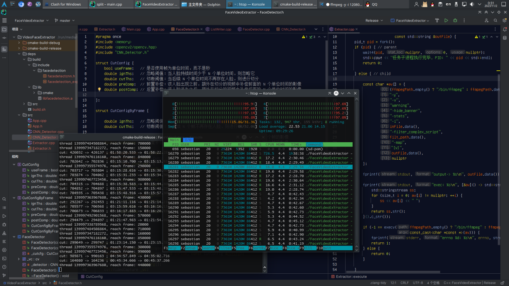
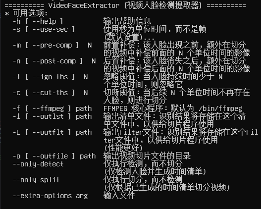

# VideoFaceExtractor
从视频录像中识别人脸，将有效片段进行切分、提取、整合以作为数据集备用

## 性能评估
并行算法，检测速度大约 375 FPS，切分未进行详细测试。
100w 帧的视频（5h/720p/60FPS 的视频）大约花费 44min 在并行检测、生成 filter_script 上。

算上切分一起大约是 1h 33 min。（我的计算机是 i7-4740MX，相对较慢，因硬件机器的处理器性能而异）

## 依赖关系

### 编译依赖
* [*] Boost (boost::program_options)
* [*] OpenCV4
* [*] [libfacedetection](https://github.com/ShiqiYu/libfacedetection)
* OpenMP 
* CUDA 

### 运行时依赖
* [*] libc++ 标准库（Windows 需要 VC++ 运行时库）
* [*] ffmpeg（切分整合阶段需要）

## 特性
* 兼容 H.264 编码的视频格式
* 切分器采用 ffmpeg 的 filter_script 提供输入，已极大地改善了性能 
* 人脸检测、片段切分、视频整合全程批处理
* 跨操作系统平台（在 Win10 x64 与 Archlinux x64 上测试通过）
* Intel AVX2/AVX512 指令集加速
* 考虑了多线程并行优化
* 不依赖 GPU
* 可配置化：可使用（帧/秒）为单位时间
  * 忽略阈值：当人脸持续时间少于 N 个单位时间，则忽略它
  * 切断阈值：当后续 N 个单位时间不再存在人脸，则进行切分
  * 前置补偿：该人脸出现之前，额外在切分的视频中补偿前面的 N 个单位时间的影像
  * 后置补偿：该人脸消失之后，额外在切分的视频中补偿后面的 N 个单位时间的影像

> 将图像帧压缩检测以显著提升性能（需要修改代码），经本人测试，目前的配置是相对最优的，故一般情况下无需修改。

## Screenshots

